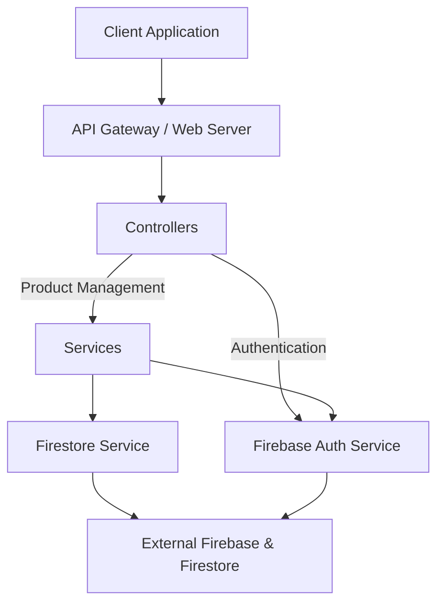

# eCommerce API Documentation

## Technology Stack
- **.NET 9.0**: Latest .NET version for the backend
- **Firebase/Firestore**: NoSQL database for data persistence
- **JWT Authentication**: For secure API access
- **Swagger/OpenAPI**: For API documentation
- **Entity Framework Core**: ORM (though using Firestore as main database)
- **xUnit**: Testing framework with FluentAssertions and Moq

## Setup Instructions

### Prerequisites
- .NET 8.0 or later installed
- A Firebase project with Firestore and Authentication (Email and Password) enabled
- A valid Firebase service account key saved as `firebase-config.json` in the project root
  - **Important**: The service account must have the "Firebase Admin" role in your Firebase project
  - You can set this role in Firebase Console > Project Settings > Service Accounts > [Your Service Account] > Edit
- Proper configuration settings in your configuration files (e.g., `appsettings.json` or environment variables) including the Firebase project ID under the key `Firebase:ProjectId`

### Installation & Running

1. Restore NuGet packages:
```bash
dotnet restore
```

2. Build the project:
```bash
dotnet build
```

3. Run the application:
```bash
dotnet run
```

Once running, you can access the Swagger UI at `https://localhost:<port>/swagger` to test the endpoints.

### Need Help?
If you encounter any issues while setting up or running the project, feel free to open an issue on this repo or shoot me a message (email). I'm always around and happy to help get things sorted out ASAP! 🚀

### Configuration
1. Update the `Firebase:ProjectId` setting in your configuration file to match your Firebase project
2. Place your `firebase-config.json` file (downloaded from your Firebase console) in the project's root directory

## Live Demo
The API is deployed and running on Google Cloud Run! You can test it out here:
- API Base URL: https://codeleap-assessment-49301233617.asia-southeast1.run.app
- Swagger UI: https://codeleap-assessment-49301233617.asia-southeast1.run.app/swagger

### Testing the Deployed API
1. Visit the Swagger UI link above to explore and test the endpoints
2. Use the Authentication endpoint to create an account or login
3. Use the returned token in the "Authorize" button (with 'Bearer' prefix) to access protected endpoints

Note: The API is running in Asia Southeast 1 region (Singapore) for optimal latency in Southeast Asia.

### Cloud Infrastructure
- **Platform**: Google Cloud Run
- **Region**: asia-southeast1 (Singapore)
- **Authentication**: Using Firebase Admin SDK with Application Default Credentials
- **Database**: Cloud Firestore in Native mode

## Project Structure & Architecture

### Solution Organization
The solution is organized into two main projects:
- **eCommerce.API**: The main application containing all business logic, controllers, and services
- **eCommerce.Tests**: Contains unit tests for the API

### API Project Structure
```
eCommerce.API/
├── Controllers/            # API endpoints and request handling
│   ├── AuthController      # Authentication endpoints
│   └── ProductController   # Product management endpoints
├── Models/                 # Data models and DTOs
├── Services/               # Business logic implementation
│   ├── FirebaseAuth        # Authentication service
│   ├── FirestoreService    # Database operations
│   └── ProductService      # Product management logic
├── Middleware/             # Custom middleware (error handling, etc.)
│   └── Exceptions          # Custom exception classes 
└── Program.cs              # Application configuration and DI setup
```

## Architecture Diagram

Below is a Mermaid diagram outlining the project's architecture:



## System Components

- **Client Application**: Consumes the API endpoints
- **API Gateway / Web Server**: Handled by ASP.NET Core (`Program.cs`) with middleware, authentication, and Swagger configuration
- **Controllers**: `AuthController` and `ProductController` process incoming HTTP requests
- **Services**: Encapsulate business logic (e.g., `ProductService`, `FirebaseAuthService`) and interact with Firestore via the `FirestoreService`
- **Error Handling Middleware**: Intercepts exceptions to return standardized error responses

## Design Decisions
I want to be transparent here - while I've heard about various architectural patterns like Clean Architecture, DDD, and Onion Architecture, I'm still learning about them and wouldn't claim this project strictly follows any of them 😅

The project structure I used is based on my practical experience and what made sense for the requirements:
- Separating concerns into different layers (Controllers, Services, Data Access)
- Making components replaceable (like how we could swap Firestore for another database)
- Keeping business logic isolated from external dependencies
- Using dependency injection for better testing and maintainability

While this might not perfectly match any textbook architecture pattern, it's worked well for our needs by keeping the code organized, testable, and easy to understand. I'm definitely interested in learning more about formal architectural patterns for future projects!

### Firebase & Firestore Integration
I initially planned to use PostgreSQL since it was already installed on my machine and I'm more comfortable with SQL databases. However, when I thought about deployment, I realized I don't have much DevOps experience and setting up a production database would probably give me a headache 😅

So, I decided to go with Firebase/Firestore instead because:
- It's already deployed in the cloud - no server setup needed! 🎉
- Setting it up is super straightforward
- It comes with authentication out of the box
- Scales automatically (one less thing to worry about)
- Their docs and SDK are really developer-friendly

While PostgreSQL might have been the "proper" choice, Firebase just made more sense for getting this project up and running quickly without getting stuck on infrastructure setup.

## Testing
I'll be honest - I'm still learning when it comes to unit testing 🎯. While I used Copilot to help generate some test cases, I ran into some challenges getting them all to pass. Some tests might still be failing or need improvements.

I know this isn't ideal, but I wanted to be transparent about it. I'm committed to improving the test coverage and quality even after submitting this project. It's definitely an area where I'm actively learning and working to get better!

While most of the core functionality is working as expected, the test suite needs more attention to reach production quality. I plan to:
- Review and fix failing tests
- Add more comprehensive test cases
- Improve test organization and documentation